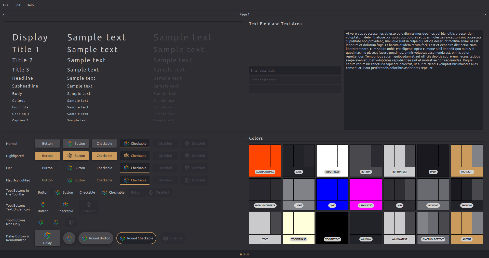
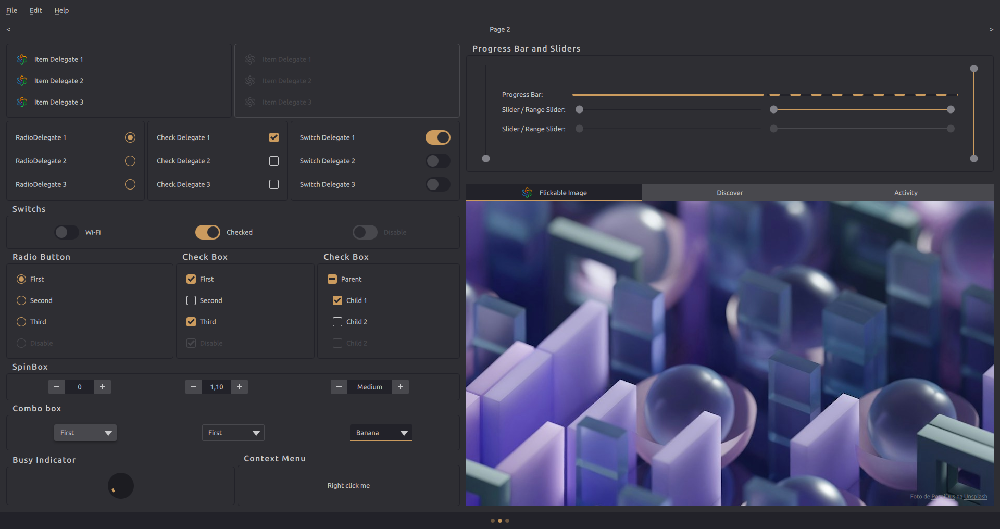
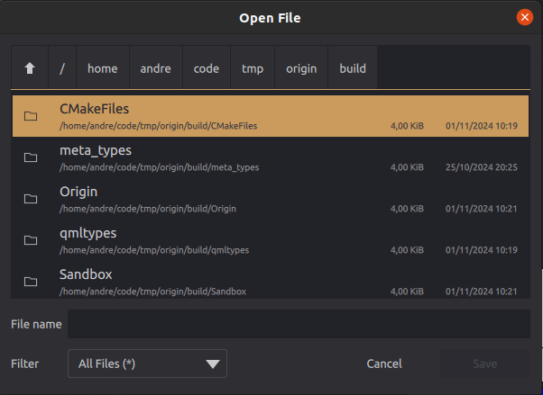
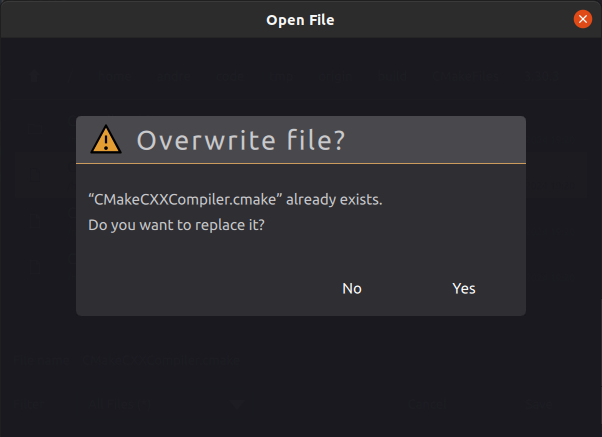
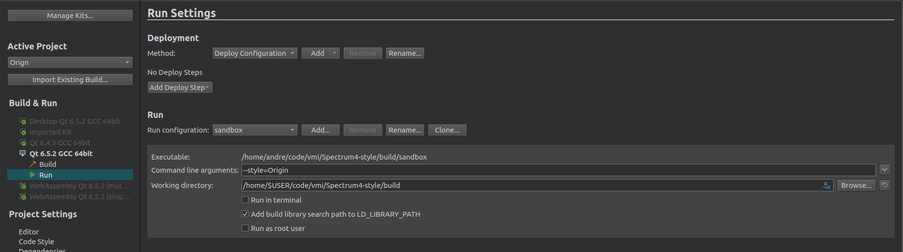

# Origin Style






## How Build Style

``` shell
git clone git@gitlab.com:q-one/origin.git
mkdir build && cd build
cmake -S .. -G Ninja -DCMAKE_PREFIX_PATH=<Qt install path> -DCMAKE_BUILD_TYPE=Release 
ninja
```

### Add the Origin folder to your project to use statically.

``` qml  
import QtQuick
import QtQuick.Layouts

import Origin

ApplicationWindow {
  id: root
  width: 1920
  height: 1080
  visible: true
  title: qsTr("Sandbox")

  RowLayout {
    anchors.fill: parent
    
    Button {}
    Switch {}
  }
}
```


### Using style dynamically
<https://doc.qt.io/qt-6/qtquickcontrols-styles.html#using-styles-in-qt-quick-controls>

``` qml  
import QtQuick
import QtQuick.Layouts
import QtQuick.Controls

ApplicationWindow {
  id: root
  width: 1920
  height: 1080
  visible: true
  title: qsTr("Sandbox")

  RowLayout {
    anchors.fill: parent
    
    Button {}
    Switch {}
  }
}
```

``` shell
./sandbox --style=Origin
```

## QtCreator

#### To compile using Qt Creator
+ Go to projects (ctrl+5)
+ Choose the kit and select the **Run** option
+ In **Run Settings** add the instruction **--style=Origin** in the **Command line arguments:** field


